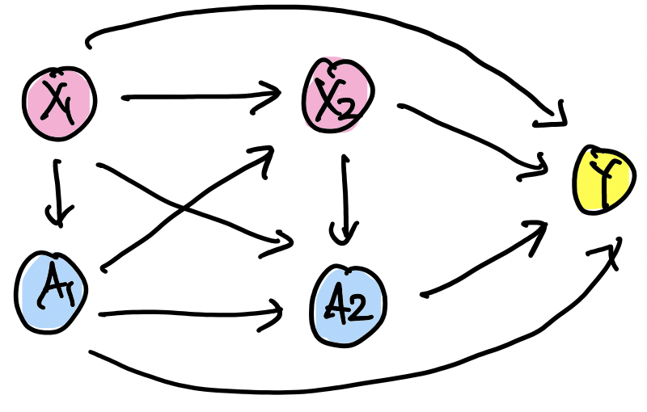

```{r setup, include=FALSE}
knitr::opts_chunk$set(collapse = TRUE)
```

---

  In this project, we will review a paper *Q- and A-learning Methods for Estimating Optimal Dynamic Treatment Regimes* written by Phillip J. Schulte et al., (2014) [[paper]](https://pubmed.ncbi.nlm.nih.gov/25620840/).


  In clinical practice, clinicians make a series of decisions based on individual patient's baseline and evolving characteristics. In this paper, we wanted to make optimal sequential treatment decisions to achieve the 'best' outcome for an individual patient. The list of sequential decision rules is formalized as a dynamic treatment regime. Throughout this paper, we investigate two main methods, Q-learning and A-learning, to estimate the optimal dynamic treatment regime based on data from a clinical trial or observational study.

  Let us first introduce the following notations:
  
> * $k$ : stages or pre-specified ordered decision points $k = 1, \cdots, K$,
> * $\Omega$ : a superpopulation of patients with a patient $\omega \in \Omega$,
> * $Y$ : a final outcome of interest (assuming that large values are preferred),
> * $X_{k}$ : covariate information immediately prior to decision $k$ with value $x_{k} \in \mathcal{X}_{k}$,
> * $A_{k}$ : treatment at stage $k$ with value $a_{k} \in \mathcal{A}_{k}$ (a finite set possible options) 
>  + $\overline{a_{k}} = (a_{1}, \cdots, a_{k})$  : a possible treatment history through decision $k$ taking values in $\overline{\mathcal{A}_{k}} = \mathcal{A}_{1} \times \cdots \mathcal{A}_{k}$.
            
For example, when $k=2$, we have time-ordered variables $(X_{1}, A_{1}, X_{2}, A_{2}, Y)$, where the dependency between them can be described as the following DAG:

{width=80%}

Then we define the **potential outcomes**
  
>  \begin{align*}
>  W^{*} &= \left\{ X^{*}_{2}(a_{1}), X^{*}_{3}\big(\overline{a_{2}}\big), \cdots, X^{*}_{K}\big(\overline{a_{k-1}}\big), Y^{*}\big(\overline{a_{k}}\big) \,\, \text{ for all } \, \overline{a_{k}} \in \overline{\mathcal{A}_{k}} \right\} 
>  \end{align*}
  
  Here, $X^{*}_{K}\big(\overline{a_{k-1}}\big)(\omega)$ denotes the value of covariate information that would arise between decisions $k-1$ and $k$ for a patient $\omega \in \Omega$ who have received treatment history $\overline{a_{k-1}}$, taking value $x_{k}$ in a set $\mathcal{X}_{k}$. Similarly, $Y^{*}\big(\overline{a_{k}}\big)$ is the hypothetical outcome that would result for a patient $\omega$ who have received the full set of $K$ treatment in $\overline{a_{k}}$. For simplicity, we write $\overline{X}^{*}_{\underline{k}}\big(\overline{a_{k-1}}\big)=\{X_{1},  X^{*}_{2}(a_{1}), \cdots, X^{*}_{K}\big(\overline{a_{k-1}}\big)\}, k = 1, \cdots, K$.

---

### Dynamic Treatment Regime

A dynamic treatment regime $\mathbf{d} = (d_{1}, \cdots, d_{K})$ is a set of rules that forms an algorithm to treat individual patient over time (it is called '*dynamic*' because treatment is determined based on a patient's previous history). For example, at the $k$th stage, 

* the $k$th rule $d_{k}$ takes
  + input : $\overline{x_{k}}, \overline{a_{k-1}}$ (patient's realized covariate, and treatment history up to $k-1$th decision),
  + output : $a_{k} \in \Psi_{k}(\overline{x_{k}}, \overline{a_{k-1}}) \subset \mathcal{A}_{k}$ where $\Psi_{k}(\overline{x_{k}}, \overline{a_{k-1}})$ is a pre-specified set of possible traetment options for a patient with ($\overline{x_{k}}, \overline{a_{k-1}}$).
  
Since $d_{k}$ need only map a subset of $\overline{\mathcal{X}_{k}} \times \overline{\mathcal{A}_{k-1}}$, namely $\Gamma_{k}$, to $\mathcal{A}_{k}$, let us define the subset **recursively** as

\begin{align*}
\Gamma_{k} &= \{ (\overline{x_{k}}, \overline{a_{k-1}}) \in \overline{\mathcal{X}_{k}} \times \overline{\mathcal{A}_{k-1}} \,\, \text{ satisfying } \\
& \quad \quad \text{(i) } \, a_{j} \in \Psi_{j}\big( \overline{x_{j}}, \overline{a_{j-1}} \big), \,\, j = 1, \cdots, k-1, \\
& \quad \quad \text{(ii) } \, \mathbb{P}(\overline{X_{k}}\big(\overline{a_{k-1}} \big)=\overline{x_{k}})>0\},
\end{align*}

$k=1, \cdots, K$, determined by $\Psi=(\Psi_{1}, \cdots, \Psi_{K})$. Define the class $\mathcal{D}$ of dynamic treatment regimes to be the set of all $\mathbf{d}=(d_{1}, \cdots. d_{k})$ where $d_{k}: \Gamma_{k} \rightarrow \mathcal{A}_{k}, k=1, \cdots, K$. 

>Then, for any $\mathbf{d} \in \mathcal{D}$, define the **potential outcomes associated with $\mathbf{d}$** as 
>\begin{align*}
\left\{ X^{*}_{2}(d_{1}),  \cdots, X^{*}_{k}\big(\overline{d_{k-1}}\big), \cdots,  X^{*}_{K}\big(\overline{d_{k-1}}\big), Y^{*}\big(\mathbf{d}\big) \,\, \right\}
\end{align*}

Then how can we find an optimal regime (the 'best' treatment for a patient) with these definitions?

The expected outcome in the population with all patients who have a baseline covariate $X_{1} = x_{1}$ and follow regime $\mathbf{d}$ is $\mathbb{E}[Y^{*}\big(\mathbf{d}\big)\ | X_{1} = x_{1}]$. Then an optimal regime, $\mathbf{d}^{opt} \in \mathcal{D}$, should satisfies

\begin{align*}
& \mathbb{E}[Y^{*}\big(\mathbf{d}\big)\ | X_{1} = x_{1}] \quad \le \quad \mathbb{E}[Y^{*}\big(\mathbf{d}^{opt}\big)\ | X_{1} = x_{1}], \,\, \text{ for all } \mathbf{d} \in \mathcal{D} \text{ and all } x_{1} \in \mathcal{X}_{1} \\
\Rightarrow \,\, & \mathbb{E}[Y^{*}\big(\mathbf{d}\big)] \qquad \qquad \quad \, \le \quad \mathbb{E}[Y^{*}\big(\mathbf{d}^{opt}\big)], \qquad \quad \quad \,\, \text{ for all } \mathbf{d} \in \mathcal{D}
\end{align*}

---

### Model Setup and Assumptions

The problem is that potential outcomes for an individual patient for all $\mathbf{d} \in \mathcal{D}$ may not be observed. Therefore, the goal of dynamic treatment regime is to estimate $\mathbf{d}^{opt}$ based on data. Consider a study with a random sample of $n$ patients in $\Omega$. Assume independent and identically distributed time-ordered random variables $(X_{1i}, A_{1i}, \cdots, X_{Ki}, A_{Ki}, Y_{i}), i = 1, \cdots, n$.

Use causal framework to estimate an optimal regime from the observed data under the following assumptions:

* Consistency assumption : $X_{k} = X^{*}_{k}\big(\overline{A_{k-1}}\big), k=2, \cdots, K$ and $Y=Y^{*}\big(\overline{A_{k}}\big)$,
* Stable unit treatment value assumption (well-defineness) : a patient's covariates and outcome are not affected by treatment assignment and other patients,
* Sequential Ignorability : $A_{k} \perp W^{*} | \{\overline{X_{k}}, \overline{A_{k-1}} \}, k=1, \cdots, K$.

---

(To be continued...)